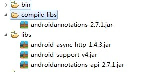
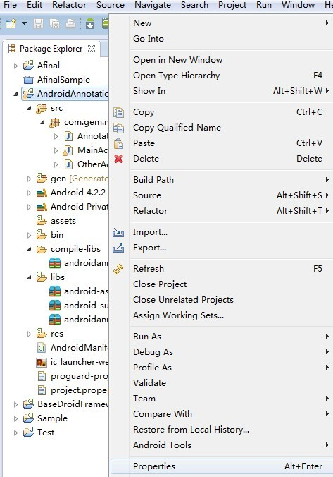
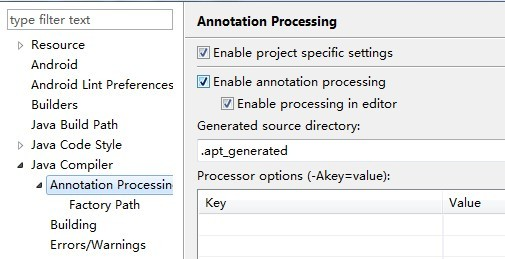
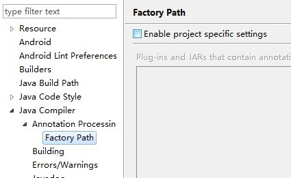
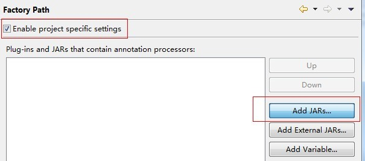
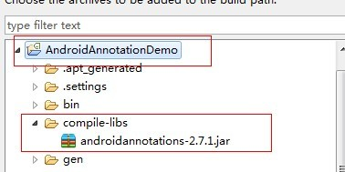

# Android Annotation Eclipse 环境配置文档

[`AndroidAnnotation`](https://github.com/excilys/androidannotations) 是托管在 [`Github`](https://github.com/) 上的开源项目
 

## 简介

AndroidAnnotations is an Open Source framework that speeds up Android development. It takes care of the plumbing, and lets you concentrate on what's really important. By simplifying your code, it facilitates its maintenance.

AndroidAnnotation 是 Android 快速开发的开源框架。该框架可以使你能够专心于开发中真正重要的部分（项目业务的逻辑以及用户体验的设计）。简单的代码，可以使你在后期更好的维护。

## 使用 AndroidAnnotation 在 Eclipse 上的配置

### 准备工作

- Android 开发工具[下载](http://developer.android.com/sdk/index.html)

- 下载 AndroidAnnotation 所依赖的包，一共有两个。[点击下载](https://github.com/excilys/androidannotations/wiki/Download)

	* `androidannotations-2.7.1.jar`
	* `androidannotations-api-2.7.1.jar`

	下载的压缩包中除了有以上两个 jar 包外，还有源码及文档

### 开始配置

- 在 eclipse 中新建一个 Android 项目
- 将 `androidannotations-api-2.7.1.jar` 放在项目的 `libs` 目录中
- 然后在项目的根目录下新建一个文件夹 `compile-libs` (注：该文件夹名字可以自己取，若自己取该文件夹名，记得用自己取得名字来替换后文中提到的所有 `compile-libs` )

	

- 点击项目，然后右键，打开 Prooerties 选项

	

- 其他一系列操作如下图所示
	
	

	
	
	

**经过以上操作，AndroidAnnotation 在 eclipse 中的环境就配置好了。接下来就体验AndroidAnnotation 带给你快速的开发体验喽^^**

